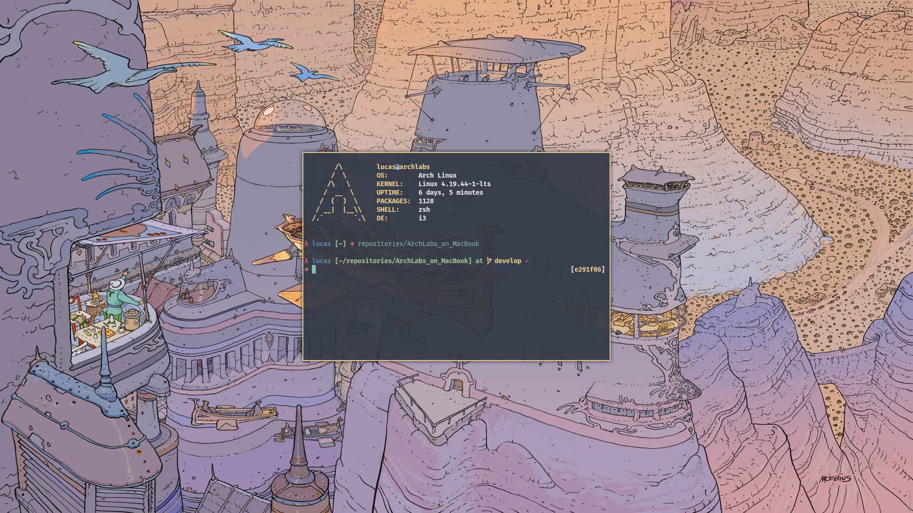

(This project is not maintained anymore)

# Configuration files for ArchLabs

This is a simple ArchLabs configuration that is currently
running on a MacBook Pro 13" 9.2 (mid 2012). 

### Why ArchLabs

I did use ArchLabs for the first time a while ago but didn't
really like it because my installation was a little bit
bloated and it was too many things too soon for me to fully
comprehend the masterpiece that it is. I tossed it and came
back to it recently and I'm loving it. ArchLabs is very
simple to install and a killer feature, personally, is that
you can choose the programs you want to install, and the
list is very minimal, making your system minimalistic and
easier to navigate.

For a laptop that is approaching 6 years of almost daily
use, ArchLabs was the answer to a ever more bloated MacOS. I
was beginning to get stressed about the loading times for
the applications, for booting the system, for the high
memory use, for having to run crappy programs and so on. On
top of all that, I don't want to buy a new Apple computer in
the foreseable future - if ever. MacBooks have been trashed
in the latest updates and are more expensive than any other
option in the market. I can say that my current laptop is
reminiscent of the golden days of Apple and I plan to use
this machine until it stops working. 

It is refreshing to use the same notebook but with a better
perfomance and easier-to-use interface - aka terminal. I'm
adapting quickly to this new setup and might do the same to
my iMac - well, I don't plan to comeback. I will continue to
update this setup until everything is working.

### Screenshots of the current setup

 

## List of features

- **Hardware that is fully working**: keyboard (and light),
    monitor brightness levels, sound controls, fan.
- **Hardware that is working but not ideally**: the battery
    is having a higher consumption.
- **Software installed**: st, vifm, rofi, dunst, neovim
    (using vim-plug with no issues), emacs (doom-emacs), mpv, flameshot, newsboat
- **User interface**: i3 gaps w/ nord theme.

## Quick fixes and tips

This section is located in a [wiki
page](https://github.com/isetfiretotherain/ArchLabs_on_MacBook/wiki)
for your convenience.

## Coming soon

- [x] mutt
- [x] music setup with ncmpcpp 
- [x] list of features
- [x] newsboat setup 
- [x] further information links

For more information on new features visit the [issues
page](https://github.com/isetfiretotherain/ArchLabs_on_MacBook/issues).

## Further information

I found a really useful article by [Michael
Chladek](https://mchladek.me/post/arch-mbp/) on his
installation on a 2015 MacBook.

## Contact information

- email: isetfire@protonmail.com
